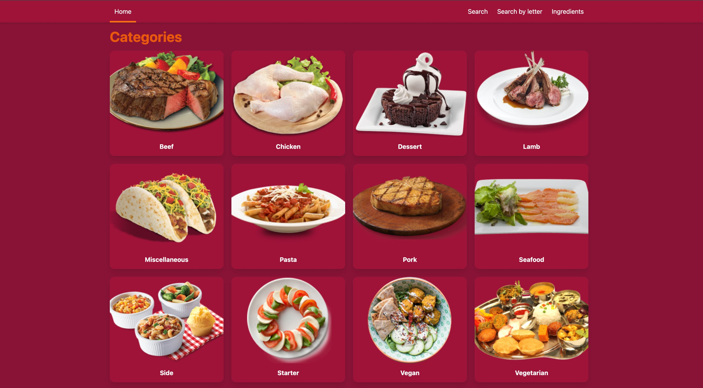

# Meals App 🥘

**[VIEW LIVE PAGE](https://vuejs-meals-app.vercel.app/)**

---

A simplified Web Application built with Vite and Vue.js using **[TheMealDB](https://www.themealdb.com/)** as backend API. Feel free to search information about different meals, recipes and ingredients!

## Recommended IDE Setup

[VSCode](https://code.visualstudio.com/) + [Volar](https://marketplace.visualstudio.com/items?itemName=Vue.volar) (and disable Vetur).

## Dependencies and technologies

- _Vite_
- _Vue 3_
- _Vue Router_
- _Vuex_
- _Typescript_

... and more. Full list of dependencies and additional information is available in **`package.json`** file.
